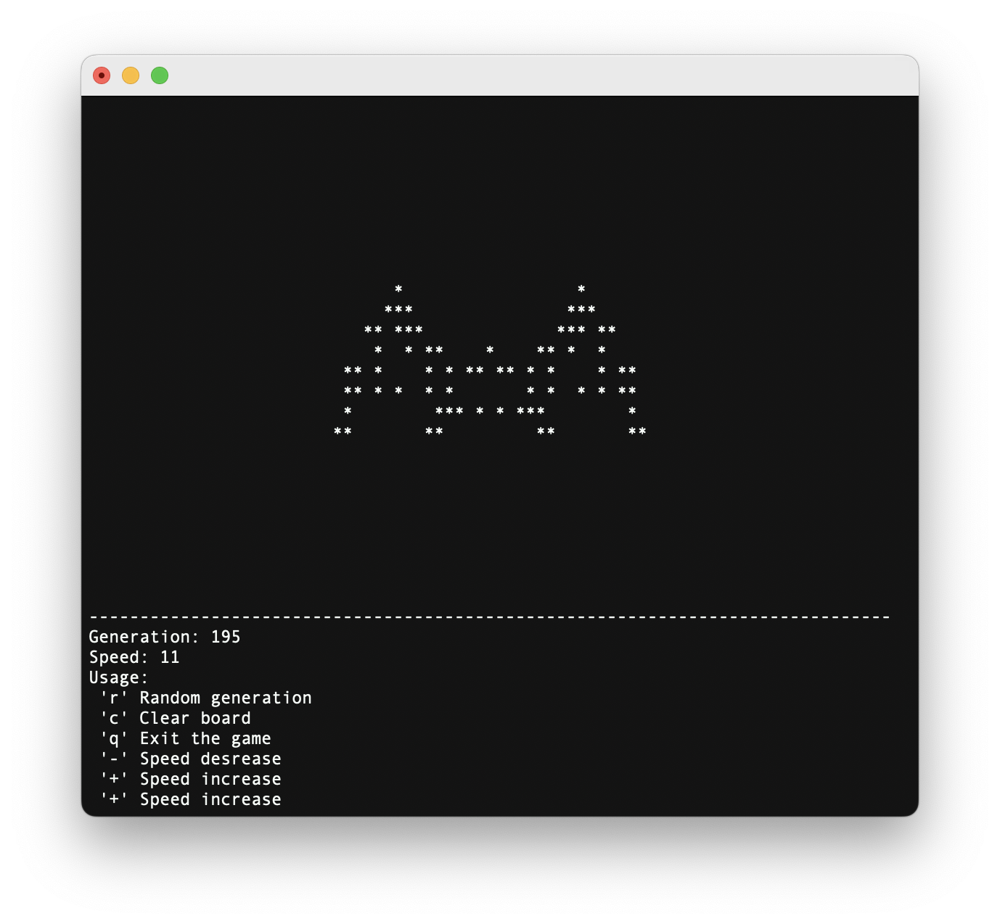

<h1>John Conway's Game of life</h1>

<h3>🐠 Описание 🐠</h3>

Моя реализация этой игры на языке <code>C</code>  
В коде используется библиотека <code>ncurses</code>  
для интерактивного режима

<h3>🐟 Сборка 🐟</h3>

Делается из корневой папки  
<code>gcc -Wall -Werror -Wextra -lncurses -std=c1
./src/game_of_life.c -o game_of_life.out</code>

<h3>🪼 Запуск 🪼</h3>

Для запуска требуется передать заготовленный рисунок  
через перенаправление ввода
Для корректной работы   следует перенаправить терминал обратно после ввода  
<code>./game_of_life.out < ./payloads/\<file>.txt < /dev/tty</code>  

<h3>🦑 Скриншоты 🦑</h3>

